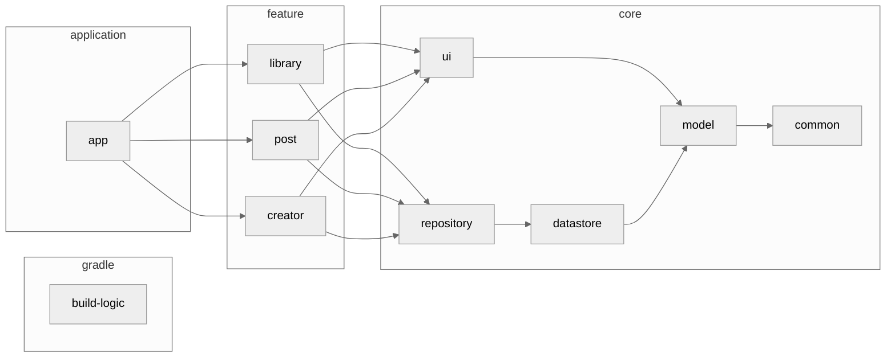

<h1 align="center">PixiView</h1>

<p align="center">
PixiView で快適な FANBOX ライフを！<br>
PixiView は PIXIV FANBOX の非公式 Android クライアントアプリです
</p>

<div align="center">
  <a href="./LICENSE">
    
  </a>
  <a href="">
    
  </a>
  <a href="https://open.vscode.dev/matsumo0922/PixiView">
    
  </a>
</div>

<hr>

<p align="center">
    
</p>


## Status
#### Deprecated!! ⚠️

このリポジトリはまもなくアーカイブされます。
このリポジトリを元にKMP対応させた[新しいリポジトリ](https://github.com/matsumo0922/PixiView-KMP)の方を今後はご利用ください。

## Why?

FANBOX には Web 版しかなく、スマートフォンで投稿を閲覧するには少し不便だったからです。スマートフォン向けアプリとしてネイティブで開発することによって、投稿のダウンロード機能や新着通知などの便利な機能を複数搭載できました。

## Tech Stack

- <a href="https://kotlinlang.org/">Kotlin</a>
- <a href="https://kotlinlang.org/docs/coroutines-overview.html">Kotlin Coroutines</a>
- <a href="https://kotlinlang.org/docs/flow.html">Kotlin Flow</a>
- <a href="https://developer.android.com/jetpack/compose?hl=ja">Jetpack Compose</a>
- <a href="https://developer.android.com/jetpack/compose/glance">Jetpack Glance</a>
- <a href="https://m3.material.io">Material3</a>

## Feature
#### Ready!!

- FANBOX
  - フォローしているクリエイターの投稿を時系列順に表示
  - 支援しているクリエイターの投稿を時系列順に表示
  - フォローしているクリエイターを表示
  - 支援しているクリエイターを表示
  - クリエイターのフォロー / フォロー解除
  - 投稿のいいね
  - クリエイター検索
  - タグ検索
  - プラン検索
  - 通知の表示
  - メッセージの表示
- ダウンロード
  - 画像 / ファイル / GIF 形式でダウンロード
  - 投稿に含まれるすべての画像をダウンロード
  - ファンカードのダウンロード
  - クリエイター単位での一括ダウンロード機能
- 広告
  - AdMob Native 広告

#### Not Ready...

- Pixiv 連携機能
- ウィジェット機能

## Architecture
アプリのアーキテクチャ図を示します。 だいぶ複雑になっているので、一部のモジュールや依存関係は省略し、概略を掴める形にしています。



## Contribute

セットアップはとても簡単で、このリポジトリをクローン氏 `bundle install` するだけです。このアプリは [daifuku](https://github.com/cookpad/daifuku) と [Puree](https://github.com/cookpad/puree-kotlin) を用いてログ基盤を作成しています。詳しくはライブラリのドキュメントまたは `./scripts/daifuku` 以下をご覧ください。

このアプリは Gradle の Convention Plugins を用いてビルドのロジックを共通化しており、`build-logic` というモジュールに全てのロジックが記述されています。このアプローチに関しては、[nowinandroid](https://github.com/matsumo0922/nowinandroid/tree/main/build-logic) をご覧ください。

何か不具合を発見したり機能を改善したい場合、機能を新たに開発したい場合は、まず issue を書いてください。その上であなた自身を assign し、開発に取り組んでください。pull request はいつでも歓迎です :smile:

このアプリは AdMob を用いて収益化しています。GitHub から手動でビルドする際は AdMob App ID を `local.properties` に記述する必要があります。デフォルトではダミーの ID が入っているため、起動時にクラッシュします。もしくは AdMob の当該コードを削除してからアプリをビルドしてください。その他、 `local.properties` には様々な ID が記述されています。詳細は `app/build.gradle.kts` または `PixiViewConfig` をご覧ください。

## License

```text
PixiView
Copyright 2025 daichi-matsumoto

Licensed under the Creative Commons NonCommercial License (the "License");
you may not use this file except in compliance with the License.
You may obtain a copy of the License at

https://creativecommons.org/licenses/by-nc/4.0/

Unless required by applicable law or agreed to in writing, software
distributed under the License is distributed on an "AS IS" BASIS,
WITHOUT WARRANTIES OR CONDITIONS OF ANY KIND, either express or implied.
See the License for the specific language governing permissions and
limitations under the License.
```
