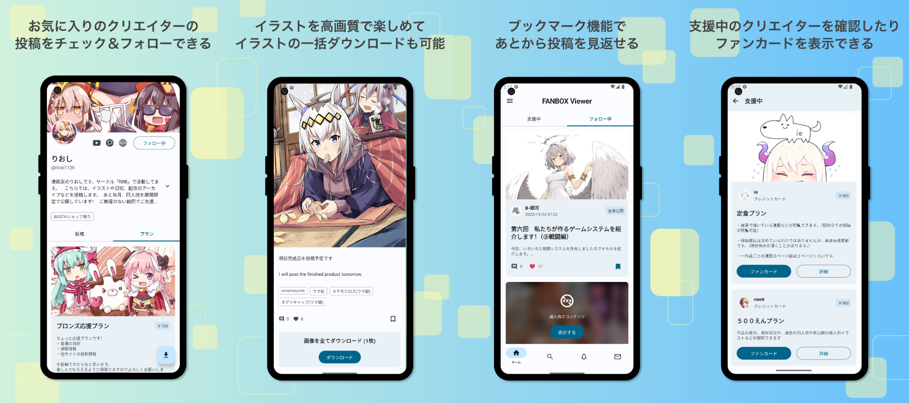
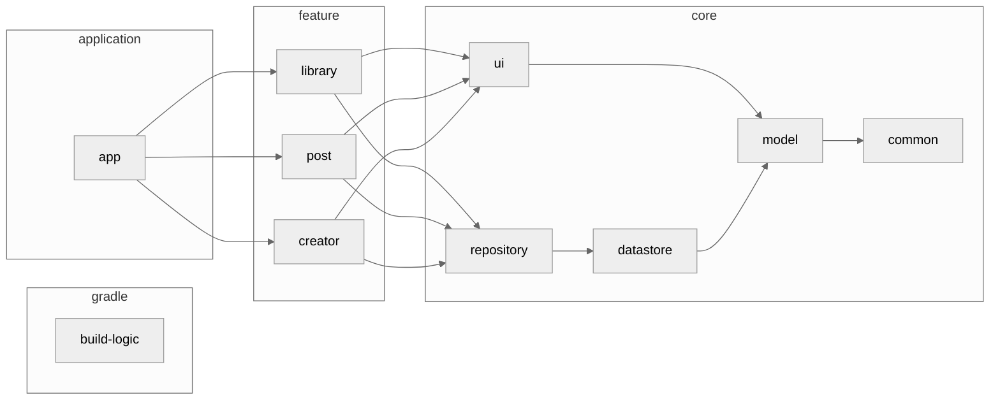

<h1 align="center">PixiView</h1>

<p align="center">
PixiView で快適な FANBOX ライフを！<br>
PixiView は PIXIV FANBOX の非公式 Android クライアントアプリです
</p>

<div align="center">
  <a href="./LICENSE">
    
  </a>
  <a href="">
    
  </a>
  <a href="https://open.vscode.dev/matsumo0922/PixiView">
    
  </a>
</div>

<hr>

<p align="center">
    
</p>


## Status
#### Ready!! :rocket:

Google Play にて公開中です！下記のリンクからダウンロードしてください。
また、Android 開発者の方はアプリをビルドして、自分でインストールすることもできます。
コントリビュートはいつでも歓迎です。下のセクションに従ってアプリをビルドしてみてください。

#### [Download](https://play.google.com/store/apps/details?id=caios.android.fanbox) from GooglePlay
#### [Download](https://github.com/matsumo0922/PixiView/releases) from GitHub

## Why?

FANBOX には Web 版しかなく、スマートフォンで投稿を閲覧するには少し不便だったからです。スマートフォン向けアプリとしてネイティブで開発することによって、投稿のダウンロード機能や新着通知などの便利な機能を複数搭載できました。

## Tech Stack

- <a href="https://kotlinlang.org/">Kotlin</a>
- <a href="https://kotlinlang.org/docs/coroutines-overview.html">Kotlin Coroutines</a>
- <a href="https://kotlinlang.org/docs/flow.html">Kotlin Flow</a>
- <a href="https://developer.android.com/jetpack/compose?hl=ja">Jetpack Compose</a>
- <a href="https://developer.android.com/jetpack/compose/glance">Jetpack Glance</a>
- <a href="https://m3.material.io">Material3</a>

## Feature
#### Ready!!

- FANBOX
  - フォローしているクリエイターの投稿を時系列順に表示
  - 支援しているクリエイターの投稿を時系列順に表示
  - フォローしているクリエイターを表示
  - 支援しているクリエイターを表示
  - クリエイターのフォロー / フォロー解除
  - 投稿のいいね
  - クリエイター検索
  - タグ検索
  - プラン検索
  - 通知の表示
  - メッセージの表示
- ダウンロード
  - 画像 / ファイル / GIF 形式でダウンロード
  - 投稿に含まれるすべての画像をダウンロード
  - ファンカードのダウンロード

#### Not Ready...

- クリエイター単位での一括ダウンロード機能
- Pixiv 連携機能
- ウィジェット機能
- 広告系全般

## Architecture
アプリのアーキテクチャ図を示します。 だいぶ複雑になっているので、一部のモジュールや依存関係は省略し、概略を掴める形にしています。



## Contribute

このアプリは Gradle の Convention Plugins を用いてビルドのロジックを共通化しており、`build-logic` というモジュールに全てのロジックが記述されています。このアプローチに関しては、[nowinandroid](https://github.com/matsumo0922/nowinandroid/tree/main/build-logic) をご覧ください。

何か不具合を発見したり機能を改善したい場合、機能を新たに開発したい場合は、まず issue を書いてください。その上であなた自身を assign し、開発に取り組んでください。pull request はいつでも歓迎です :smile:

将来的に Pixiv API を用いて新規機能を開発する予定です。APIを使用する場合は `local.properties` に Client ID と Client Secret を追加してください。デフォルトでは空文字が入っています。詳細は `app/build.gradle.kts` を読んでください。 

## License

```text
PixiView
Copyright (C) 2023 daichi-matsumoto

This program is free software: you can redistribute it and/or modify
it under the terms of the GNU General Public License as published by
the Free Software Foundation, either version 3 of the License, or
(at your option) any later version.

This program is distributed in the hope that it will be useful,
but WITHOUT ANY WARRANTY; without even the implied warranty of
MERCHANTABILITY or FITNESS FOR A PARTICULAR PURPOSE.  See the
GNU General Public License for more details.

You should have received a copy of the GNU General Public License
along with this program.  If not, see <https://www.gnu.org/licenses/>.

Also you can contact me by electronic mail at caios.system@gmail.com.

If the program does terminal interaction, make it output a short
notice like this when it starts in an interactive mode:

    PixiView  Copyright (C) 2023 daichi-matsumoto
    This program comes with ABSOLUTELY NO WARRANTY; for details type `show w'.
    This is free software, and you are welcome to redistribute it
    under certain conditions; type `show c' for details.

The hypothetical commands `show w' and `show c' should show the appropriate
parts of the General Public License.  Of course, your program's commands
might be different; for a GUI interface, you would use an "about box".

You should also get your employer (if you work as a programmer) or school,
if any, to sign a "copyright disclaimer" for the program, if necessary.
For more information on this, and how to apply and follow the GNU GPL, see
<https://www.gnu.org/licenses/>.

The GNU General Public License does not permit incorporating your program
into proprietary programs.  If your program is a subroutine library, you
may consider it more useful to permit linking proprietary applications with
the library.  If this is what you want to do, use the GNU Lesser General
Public License instead of this License.  But first, please read
<https://www.gnu.org/licenses/why-not-lgpl.html>.
```
