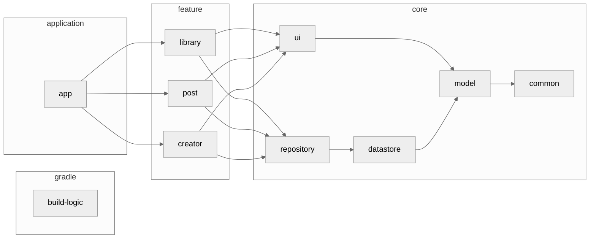

<h1 align="center">PixiView</h1>

<p align="center">
Enjoy a comfortable FANBOX life with PixiView!<br>
PixiView is an unofficial Android client app for PIXIV FANBOX.
</p>

<div align="center">
  <a href="./LICENSE">
    
  </a>
  <a href="">
    
  </a>
  <a href="https://open.vscode.dev/matsumo0922/PixiView">
    
  </a>
</div>

<hr>

<p align="center">
    
</p>

<p align="center">Do you speak Japanese? Japanese <a href="./README-JA.md">READEME</a> is Here!</p>

## Status
#### Deprecated!! ⚠️

This repository will be archived soon.
Please use the [new repository](https://github.com/matsumo0922/PixiView-KMP) which is KMP-compatible based on this repository from now on.

## Why?

There was only a web version of FANBOX, which was a bit inconvenient for viewing posts on smartphones. By developing natively for smartphones, we have been able to include several convenient features such as the ability to download posts and receive new notifications.

## Tech Stack

- [Kotlin](https://kotlinlang.org/)
- [Kotlin Coroutines](https://kotlinlang.org/docs/coroutines-overview.html)
- [Kotlin Flow](https://kotlinlang.org/docs/flow.html)
- [Jetpack Compose](https://developer.android.com/jetpack/compose?hl=ja)
- [Jetpack Glance](https://developer.android.com/jetpack/compose/glance)
- [Material3](https://m3.material.io)

## Feature
#### Ready!!

- FANBOX
  - Display posts from followed creators in chronological order.
  - Display posts from supported creators in chronological order.
  - Display followed creators.
  - Display supported creators.
  - Follow/Unfollow creators.
  - Like posts.
  - Search for creators.
  - Search by tags.
  - Search plans.
  - Display notifications.
  - Display messages.
- Download
  - Download in image/file/GIF format.
  - Download all images included in a post.
  - Download fan cards.
  - Bulk download function for individual creators.
- Ads
  - AdMob Native Ads

#### Not Ready...

- Pixiv integration feature.
- Widget functionality.

## Architecture
Shows the architecture diagram of the app. It's quite complex, so I've omitted some modules and dependencies to give you an overview.



## Contribute

Setup is very easy, just clone this repository and `bundle install`. This app uses [daifuku](https:github.comcookpaddaifuku) and [Puree](https:github.comcookpadpuree-kotlin) to create the log infrastructure. For more information, please see the library documentation or `./scripts/daifuku`.

This app uses Gradle's Convention Plugins to standardize the build logic, and all the logic is written in a module called `build-logic`. For information on this approach, see [nowinandroid](https://github.com/matsumo0922/nowinandroid/tree/main/build-logic).

If you find a bug, want to improve a feature, or want to develop a new feature, please first write an issue. Then assign yourself and work on the development. Pull requests are always welcome :smile:

This app is monetized using AdMob. When building manually from GitHub, you need to write the AdMob App ID in `local.properties`. By default it contains a dummy ID, which causes it to crash on startup. Alternatively, please delete the AdMob code and build the app. In addition, various IDs are described in `local.properties`. See `app/build.gradle.kts` or `PixiViewConfig` for details.

## License

```text
PixiView
Copyright 2025 daichi-matsumoto

Licensed under the Creative Commons NonCommercial License (the "License");
you may not use this file except in compliance with the License.
You may obtain a copy of the License at

https://creativecommons.org/licenses/by-nc/4.0/

Unless required by applicable law or agreed to in writing, software
distributed under the License is distributed on an "AS IS" BASIS,
WITHOUT WARRANTIES OR CONDITIONS OF ANY KIND, either express or implied.
See the License for the specific language governing permissions and
limitations under the License.
```
