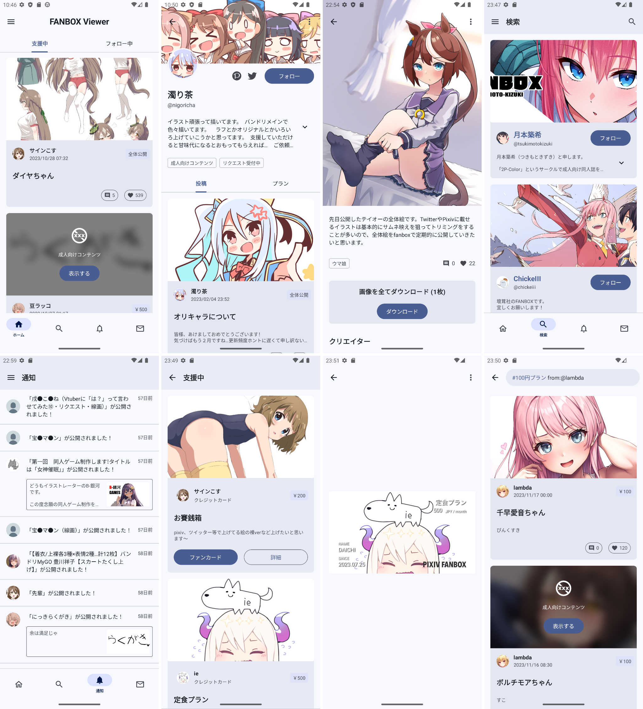
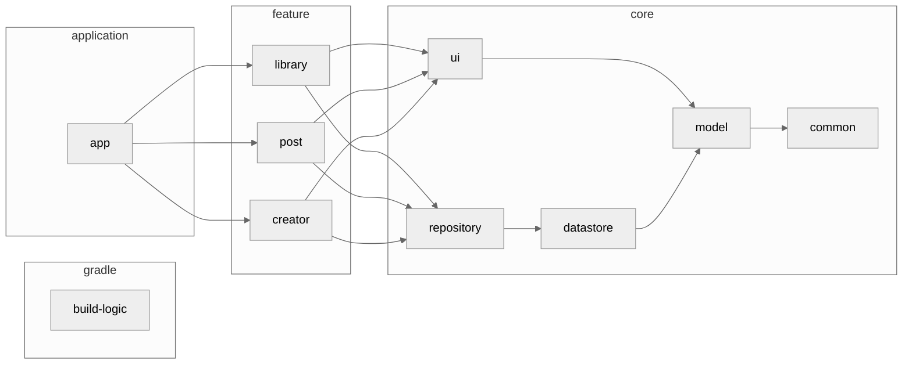

<h1 align="center">PixiView</h1>

<p align="center">
Enjoy a comfortable FANBOX life with PixiView!<br>
PixiView is an unofficial Android client app for PIXIV FANBOX.
</p>

<div align="center">
  <a href="./LICENSE">
    
  </a>
  <a href="">
    
  </a>
  <a href="https://open.vscode.dev/matsumo0922/PixiView">
    
  </a>
</div>

<hr>

<p align="center">
    
</p>

<p align="center">Do you speak Japanese? Japanese <a href="./README-JA.md">READEME</a> is Here!</p>

## Status
#### Ready!! :rocket:

After a long development period, we have finally released on GooglePlay!
However, development is still ongoing, and contributions are always welcome. Please follow the sections below to build the app.

#### [Download](https://play.google.com/store/apps/details?id=caios.android.pixiview) from GooglePlay

## Why?

There was only a web version of FANBOX, which was a bit inconvenient for viewing posts on smartphones. By developing natively for smartphones, we have been able to include several convenient features such as the ability to download posts and receive new notifications.

## Tech Stack

- [Kotlin](https://kotlinlang.org/)
- [Kotlin Coroutines](https://kotlinlang.org/docs/coroutines-overview.html)
- [Kotlin Flow](https://kotlinlang.org/docs/flow.html)
- [Jetpack Compose](https://developer.android.com/jetpack/compose?hl=ja)
- [Jetpack Glance](https://developer.android.com/jetpack/compose/glance)
- [Material3](https://m3.material.io)

## Feature
#### Ready!!

- FANBOX
  - Display posts from followed creators in chronological order.
  - Display posts from supported creators in chronological order.
  - Display followed creators.
  - Display supported creators.
  - Follow/Unfollow creators.
  - Like posts.
  - Search for creators.
  - Search by tags.
  - Search plans.
  - Display notifications.
  - Display messages.
- Download
  - Download in image/file/GIF format.
  - Download all images included in a post.
  - Download fan cards.

#### Not Ready...

- Bulk download function for individual creators.
- Pixiv integration feature.
- Widget functionality.
- All advertising-related features.

## Architecture
Shows the architecture diagram of the app. It's quite complex, so I've omitted some modules and dependencies to give you an overview.



## Contribute

This app uses Gradle's Convention Plugins to standardize the build logic, and all the logic is written in a module called `build-logic`. For information on this approach, see [nowinandroid](https://github.com/matsumo0922/nowinandroid/tree/main/build-logic).

If you find a bug, want to improve a feature, or want to develop a new feature, please first write an issue. Then assign yourself and work on the development. Pull requests are always welcome :smile:

We plan to develop new features using the Pixiv API in the future. When using the API, add Client ID and Client Secret to `local.properties`. By default, it contains an empty string. Read `app/build.gradle.kts` for details.

## License

```text
PixiView
Copyright (C) 2023 daichi-matsumoto

This program is free software: you can redistribute it and/or modify
it under the terms of the GNU General Public License as published by
the Free Software Foundation, either version 3 of the License, or
(at your option) any later version.

This program is distributed in the hope that it will be useful,
but WITHOUT ANY WARRANTY; without even the implied warranty of
MERCHANTABILITY or FITNESS FOR A PARTICULAR PURPOSE.  See the
GNU General Public License for more details.

You should have received a copy of the GNU General Public License
along with this program.  If not, see <https://www.gnu.org/licenses/>.

Also you can contact me by electronic mail at caios.system@gmail.com.

If the program does terminal interaction, make it output a short
notice like this when it starts in an interactive mode:

    PixiView  Copyright (C) 2023 daichi-matsumoto
    This program comes with ABSOLUTELY NO WARRANTY; for details type `show w'.
    This is free software, and you are welcome to redistribute it
    under certain conditions; type `show c' for details.

The hypothetical commands `show w' and `show c' should show the appropriate
parts of the General Public License.  Of course, your program's commands
might be different; for a GUI interface, you would use an "about box".

You should also get your employer (if you work as a programmer) or school,
if any, to sign a "copyright disclaimer" for the program, if necessary.
For more information on this, and how to apply and follow the GNU GPL, see
<https://www.gnu.org/licenses/>.

The GNU General Public License does not permit incorporating your program
into proprietary programs.  If your program is a subroutine library, you
may consider it more useful to permit linking proprietary applications with
the library.  If this is what you want to do, use the GNU Lesser General
Public License instead of this License.  But first, please read
<https://www.gnu.org/licenses/why-not-lgpl.html>.
```
